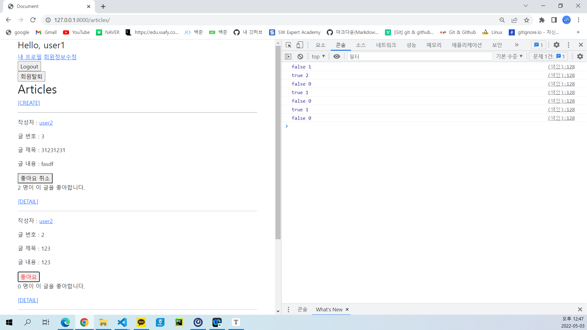

# 좋아요 기능




## views.py

```python
@require_POST
def likes(request, article_pk):
    # CODE HERE
    if request.user.is_authenticated:
        article = get_object_or_404(Article, pk=article_pk)
        # if request.user in article.like_users.all():
        if article.like_users.filter(pk=request.user.pk).exists():
            article.like_users.remove(request.user)
            isLiked = False
        else:
            article.like_users.add(request.user)
            isLiked = True
        context={
            'isLiked': isLiked,
            'likedCount': article.like_users.count(),
        }
        return JsonResponse(context)
        # return redirect('articles:index')

    return redirect('accounts:login')
```


## index.html

```html



  <h1>Articles</h1>
  
    <a href="">[CREATE]</a>
  
    <a href="">[새 글을 작성하려면 로그인하세요.]</a>
  
  <hr>
  
    <p>작성자 : 
      <a href="">{{ article.user }}</a>
    </p>
    <p>글 번호 : {{ article.pk }}</p>
    <p>글 제목 : {{ article.title }}</p>
    <p>글 내용 : {{ article.content }}</p>
    <div>
      <form class="like-form" data-article-id="{{ article.pk }}">
        
        
          <button id="like-{{ article.pk }}">좋아요 취소</button>
        
          <button id="like-{{ article.pk }}">좋아요</button>
        
      </form>
      <p>
        <span id="like-count-{{ article.pk }}">
          {{ article.like_users.all|length }}
        </span>
        명이 이 글을 좋아합니다.
      </p>
    </div>
    <a href="">[DETAIL]</a>
    <hr>
  



  <script>
    // CODE HERE
    const forms = document.querySelectorAll('.like-form')
    const csrftoken = document.querySelector('[name=csrfmiddlewaretoken]').value;

    // console.log(forms)
    forms.forEach((form)=>{
      // console.log(form)
      form.addEventListener('submit', (event)=>{
        event.preventDefault()
        // console.log(event.target.dataset.articleId)
        const articleId = event.target.dataset.articleId
        //axios.get('http://127.0.0.1:8000/articles/${articleId}/likes/')
        axios({
          method:'post',
          url: `http://127.0.0.1:8000/articles/${articleId}/likes/`,
          headers: {'X-CSRFToken': csrftoken},
        })
          .then(response => {
            const { isLiked, likedCount } = response.data
            console.log(isLiked, likedCount)
            const likeBtn = document.querySelector(`#like-${articleId}`)
            const likeCount = document.querySelector(`#like-count-${articleId}`)
            likeCount.innerText = likedCount
            //console.log(likeBtn)
            if (isLiked) {
              likeBtn.innerText = '좋아요 취소'
              likeBtn.style.color = 'black'
            }
            else {
              likeBtn.innerText = '좋아요'
              likeBtn.style.color = 'red'
            }
          })
      })
    })
  </script>


```

