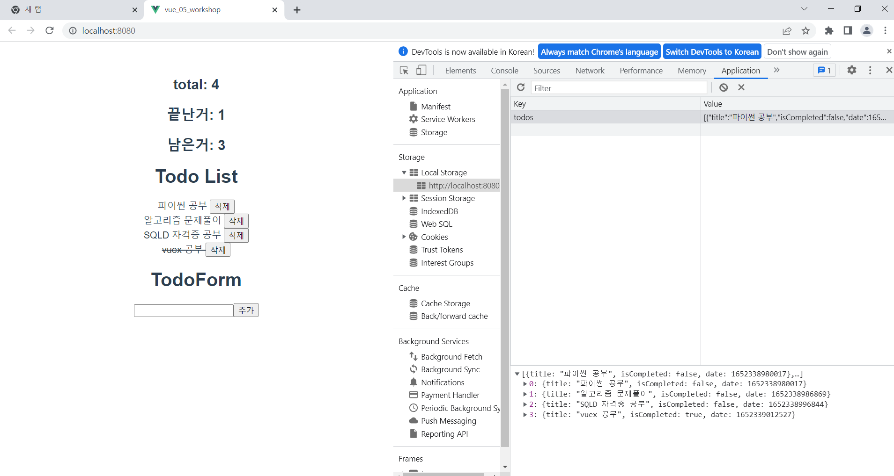

# App.vue

```vue
<template>
  <div id="app">
    <h2>total: {{ allTodosCount }}</h2>
    <h2>끝난거: {{ completedTodosCount }}</h2>
    <h2>남은거: {{ uncompletedTodosCount }}</h2>

    <todo-list/>
    <todo-form/>
  </div>
</template>

<script>
// import HelloWorld from './components/HelloWorld.vue'
import TodoForm from '@/components/TodoForm.vue'
import TodoList from '@/components/TodoList.vue'
import { mapGetters, mapMutations } from 'vuex'

export default {
  name: 'App',
  components: {
    TodoForm,
    TodoList
  },
  computed: {
    ...mapGetters([
      'allTodosCount',
      'completedTodosCount',
      'uncompletedTodosCount',
    ])
  },
  methods: {
    ...mapMutations(['LOAD_TODOS'])
    // loadTodos() {
    //   this.$store.commit('LOAD_TODOS')
    // }
  },
  created() {
    this.LOAD_TODOS()
    // this.$store.commit('LOAD_TODOS')
  }
}
</script>

<style>
#app {
  font-family: Avenir, Helvetica, Arial, sans-serif;
  -webkit-font-smoothing: antialiased;
  -moz-osx-font-smoothing: grayscale;
  text-align: center;
  color: #2c3e50;
  margin-top: 60px;
}
</style>

```


# index.js

```js
import Vue from 'vue'
import Vuex from 'vuex'

Vue.use(Vuex)

export default new Vuex.Store({
  state: {
    todos: [
      // {title: '잠깨기', isCompleted:false, date: new Date().getDate()},
      // {title: '수업듣기', isCompleted:false, date: new Date().getDate()+1},
    ],
  },
  getters: {
    allTodosCount(state) {
      return state.todos.length
    },
    completedTodosCount(state) {
      return state.todos.filter(todo=>todo.isCompleted).length
    },
    uncompletedTodosCount(state) {
      return state.todos.filter(todo=>!todo.isCompleted).length
    }
  },
  mutations: {
    LOAD_TODOS(state) {
      state.todos = JSON.parse(localStorage.getItem('todos'))
    },
    CREATE_TODO(state,newTodo) {
      state.todos.push(newTodo)
    },
    DELETE_TODO(state, todoItem) {
      const index = state.todos.indexOf(todoItem)
      state.todos.splice(index, 1)
    },
    UPDATE_TODO(state, todoItem) {
      const index = state.todos.indexOf(todoItem)
      state.todos[index].isCompleted = !todoItem.isCompleted
    }
  },
  actions: {
    saveTodos(context) {
      const stringTodo = JSON.stringify(context.state.todos)
      localStorage.setItem('todos', stringTodo)
    },
    createTodo(context, newTodo) {
      context.commit('CREATE_TODO', newTodo)
      context.dispatch('saveTodos')
    },
    deleteTodo({commit, dispatch}, todoItem) {
      commit('DELETE_TODO', todoItem)
      dispatch('saveTodos')
    },
    updateTodo({commit, dispatch}, todoItem) {
      commit('UPDATE_TODO', todoItem)
      dispatch('saveTodos')
    },
  },
  modules: {
  }
})

```

# TodoForm.vue

```vue
<template>
  <div>
      <h1>TodoForm</h1>
      <input type="text" v-model.trim="newTitle" @keyup.enter="createTodo">
      <button @click="createTodo">추가</button>
  </div>
</template>

<script>
export default {
    name: 'TodoForm',
    data: function() {
      return {
        newTitle: ''
      }
    },
    methods: {
      createTodo: function () {
        // console.log(this.newTitle)
        const newTodo = {
          title: this.newTitle,
          isCompleted: false,
          date: new Date().getTime()
        }
        this.$store.dispatch('createTodo', newTodo)
        this.newTitle = ''
      }
    }
}
</script>

<style>

</style>
```

# TodoList.vue

```vue
<template>
  <div>
    <h1>Todo List</h1>
    <todo-list-item v-for="todo in todos"
    :key="todo.date"
    :todo="todo"
    />
  </div>
</template>

<script>
import TodoListItem from '@/components/TodoListItem.vue'

export default {
  name: 'TodoList',
  components: {
    TodoListItem,
  },
  computed: {
    todos() {
      return this.$store.state.todos
    }
  }
}
</script>

<style>

</style>
```

# TodoListItem.vue

```vue
<template>
  <div>
    <!-- {{ todo }} -->
    <span @click="updateTodo(todo)" 
        :class="{'is-completed'
        : todo.isCompleted}">
        {{ todo.title }}
    </span>
    <button @click="deleteTodo(todo)">삭제</button>
  </div>
</template>

<script>
export default {
    name: 'TodoListItem',
    props: {
        todo:{
            type:Object
        }
    },
    methods: {
        deleteTodo: function () {
            this.$store.dispatch('deleteTodo', this.todo)
        },
        updateTodo: function () {
            this.$store.dispatch('updateTodo', this.todo)
        }
    }
}
</script>

<style scoped>
.is-completed {
    text-decoration: line-through;
}

span {
  cursor: pointer;
}
</style>
```

